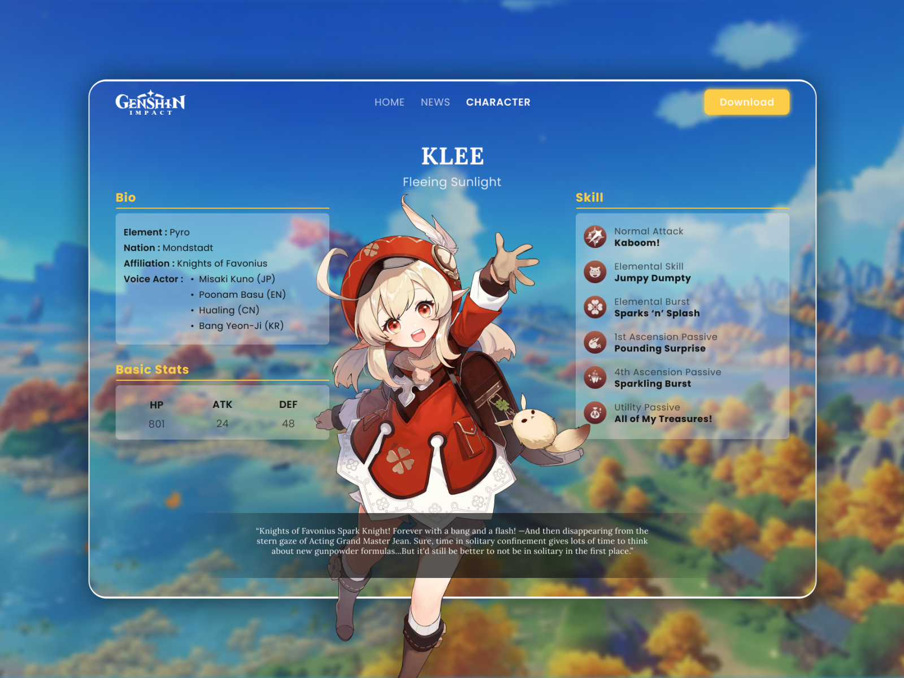

# Genshin Characters UI

<h3>Genshin Impact Characters UI Web Design</h3>
<h4>Diseño web de interfaz de usuario de personajes de Genshin Impact</h4>

Diseño basado en diseño web

<b>Fuente: </b> <a href="https://dribbble.com/shots/15891268-Genshin-Impact-Web-Design">Genshin Impact - Web Design (Fahmi Majid)</a>

<b>Funciones:</b>

Por el momento solo diseño y consulta de datos por consola de los personajes.

<b>Integración principal:</b>

API de Genshin Impact.

<b>Fuente: </b> <a href="https://github.com/theBowja/genshin-db">genshin-db</a> 

Contenido:
* Navbar
* Responsive
* Parallax
* Slider
* Tabs
* Modal
* Dropdown
* Sidebar
* Footer

Tecnologías:
* HTML
* CSS
* JavaScript
* API de Genshin Impact
* JSON Server

<b>Objetivos:</b>

* Diseño de la interfaz de usuario
* Integración completa de la API
* Representación de los datos en la interfaz
* Integración de gráficos basado en los personajes consultados

<b>Nota:<b>

*Este *repositorio* es un proyecto personal de práctica en conocimientos de Desarrollo Web Frontend y Backend, no pretendo llevarme el crédito por los elementos y recursos utilizados*.
